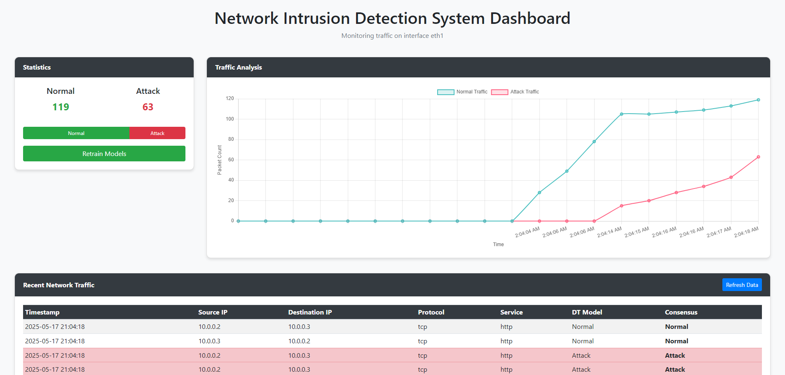
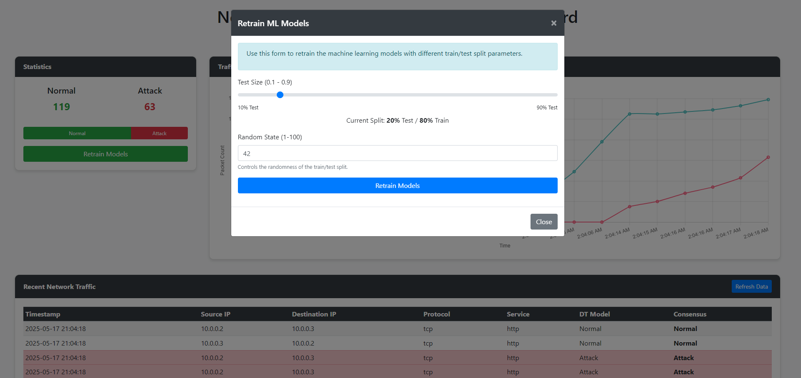
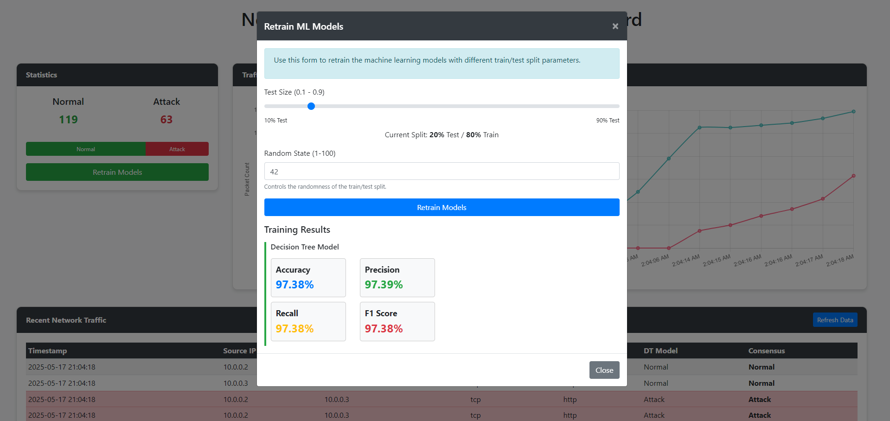
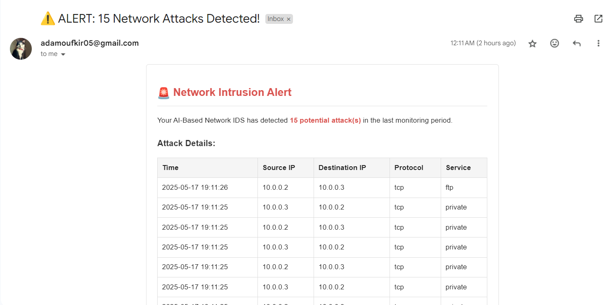

# AI-Based Network Intrusion Detection System (IDS)

## Academic Context

This project is part of the mini-project assignment for the AI for Cybersecurity course, taught by Professor Mohammed Ridouani, as part of the Licence program in "Cybersécurité et Ingénierie des Systèmes Intelligents."

## Project Overview

The AI-Based Network IDS integrates advanced Artificial Intelligence techniques, utilizing Machine Learning (ML) and Deep Learning (DL) to analyze and predict network intrusions with high accuracy. The system is designed to detect various types of attacks in real-time, providing robust protection for network environments.

## System Demonstration

### Starting the IDS Server

*The IDS server starting up on a Kali Linux system, displaying initialization messages and loading the ML models.*

### Dashboard Interface

*The main dashboard interface showing real-time network traffic monitoring, statistics on normal vs. attack traffic, and a timeline chart of detected activity.*

### Model Retraining Interface

*The model retraining interface that allows customization of test/train split parameters and random state to optimize model performance.*

### Training Results

*Training results display showing the performance metrics of the retrained Decision Tree model including accuracy, precision, recall, and F1 score.*

### Email Alert System

*The IDS includes an automated email alert system that sends notifications when a certain threshold of attacks is detected, providing detailed information about the threats including timestamp, source IP, destination IP, protocol, and service.*

## Goals and Objectives

- Develop a real-time intrusion detection system using AI/ML techniques
- Leverage the NSL-KDD dataset to train models capable of distinguishing between normal and malicious traffic
- Implement both binary classification (normal/attack) and multi-class classification of attack types
- Create a user-friendly interface for monitoring network traffic and visualizing detected threats
- Provide customization options for retraining models with different parameters
- Evaluate and compare the performance of different ML/DL approaches to intrusion detection

## How It Works

### Architecture

The system consists of several integrated components:

1. **Traffic Capture Module**: Captures and processes network packets in real-time using Scapy
2. **Feature Extraction**: Transforms raw network data into features suitable for ML processing
3. **ML/DL Models**: Pre-trained Decision Tree model that classifies traffic as normal or attack
4. **Dashboard Interface**: Web-based visualization of network traffic and security alerts
5. **Retraining Component**: Allows customization of the train/test split ratio to optimize model performance

### Data Flow

1. Network packets are captured from a specified interface (e.g., eth1)
2. Features are extracted from each packet and transformed to match the training data format
3. The preprocessed data is fed into the ML model for classification
4. Results are stored and displayed on the dashboard in real-time
5. Detected attacks are logged and can trigger alerts based on threshold settings

### Customization

The system allows for model retraining with customizable parameters:

- Adjustable train/test split ratio (10%-90%)
- Configurable random state for reproducibility
- Performance metrics are displayed after retraining to evaluate model quality

## Binary Classification Model Selection in BinaryPrediction.ipynb

The `BinaryPrediction.ipynb` notebook serves as the experimental foundation for our IDS system, thoroughly evaluating various machine learning algorithms to determine the most effective approach for binary classification of network traffic (normal vs. attack).

### Algorithms Explored

This notebook systematically evaluates multiple machine learning algorithms on the NSL-KDD dataset:

1. **Logistic Regression**: A statistical approach that models the probability of a binary outcome. It provided a good baseline for comparison with accuracy around 92%.

2. **Gaussian Naive Bayes**: A probabilistic classifier based on Bayes' theorem. While fast to train, it achieved lower accuracy (~89%) compared to other models.

3. **Support Vector Machines (SVM)**: A powerful classifier that finds optimal decision boundaries between classes. Despite good accuracy (~93%), it proved computationally expensive for real-time detection.

4. **Decision Tree**: A tree-structured model that makes decisions based on feature thresholds. It achieved excellent accuracy (~95%) with relatively low computational requirements.

5. **Random Forest**: An ensemble of decision trees that further improved accuracy to ~97%, but with increased computational overhead.

6. **Neural Networks**: Deep learning models that achieved high accuracy (~98%) but required significant computational resources and longer training times.

### Feature Importance Analysis

A key advantage of the Decision Tree and Random Forest models was their ability to provide feature importance scores, revealing which network characteristics were most indicative of attacks. The notebook includes visualizations of these importance scores, which guided our feature engineering process.

### Model Performance Comparison

Each model was evaluated using rigorous metrics:

- Accuracy, precision, recall, and F1 score on both training and test datasets
- Confusion matrices to understand error patterns
- ROC curves and AUC scores to assess discrimination ability

### Why We Chose Decision Trees for Our IDS

After comprehensive evaluation, we selected the **Decision Tree** algorithm for our production IDS system for several compelling reasons:

1. **Optimal Performance-Efficiency Balance**: While Random Forest and Neural Networks achieved marginally higher accuracy (~1-3%), the Decision Tree provided excellent accuracy (95%+) with significantly lower computational requirements, making it ideal for real-time intrusion detection.

2. **Interpretability**: The Decision Tree's transparent, rule-based structure allows security analysts to understand exactly why a particular traffic pattern was flagged as an attack—a critical advantage in security applications where explainability is essential.

3. **Low Latency**: The computational efficiency of Decision Trees translates to lower detection latency, allowing our IDS to process network packets quickly without creating bottlenecks.

4. **Feature Insights**: The Decision Tree's feature importance analysis provided valuable insights into attack signatures, which we incorporated into our feature engineering process.

5. **Memory Efficiency**: Compared to ensemble methods and neural networks, the Decision Tree's compact model size reduced the memory footprint of our IDS system.

The model evaluation conducted in the BinaryPrediction notebook directly informed our implementation choices in the production IDS system, ensuring we selected the optimal balance between detection accuracy, computational efficiency, and interpretability.

## Running Attack Simulations

The project includes an attack simulator (`attack_simulator.py`) for testing and evaluating the IDS in controlled environments. This tool lets you simulate various network attacks to verify that the IDS correctly detects them.

### Available Attack Types

1. **Port Scanning**: Simulates reconnaissance activities

   ```
   python attack_simulator.py --target 10.0.0.3 --attack port_scan --scan-type SYN --duration 15
   ```

2. **DoS Attacks**: Various denial of service attacks

   SYN Flood:

   ```
   attack_simulator.py --target 10.0.0.3 --attack syn_flood --duration 20
   ```

3. **Fragmentation Attack**: Sends fragmented packets that may evade detection

   ```
   python attack_simulator.py --target 10.0.0.3 --attack fragmentation --duration 15
   ```

### Warning

⚠️ The attack simulator should only be used in controlled environments and for educational purposes. Unauthorized use against systems you don't own is illegal and unethical.

## Getting Started

1. **Install Dependencies**:

   ```
   python3 -m venv venv
   source venv/bin/activate
   pip install -r requirements.txt
   ```

2. **Start the IDS Server**:

   ```
   python ids_server.py
   ```

3. **Access the Dashboard**:
   Open your browser and go to `http://localhost:5000`

4. **Customize and Retrain** (optional):
   - Click the "Retrain Models" button on the dashboard
   - Adjust the train/test split ratio using the slider
   - Click "Retrain Models" and view the performance metrics

## Dataset

This project uses the NSL-KDD dataset, an improved version of the KDD Cup '99 dataset that addresses issues of redundancy and bias found in the original. The dataset includes various types of network traffic including:

- Normal connections
- DoS (Denial of Service) attacks
- Probe attacks (port scanning, etc.)
- R2L (Remote to Local) attacks
- U2R (User to Root) attacks

## Future Work

- Integration of additional deep learning models (RNN, LSTM)
- Support for more diverse network environments
- Adversarial training to improve resilience against evasion attacks
- Real-time model updating based on feedback